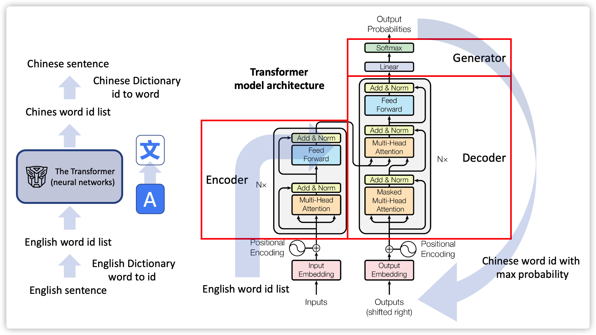

# Assignment: 

You are requseted to complete the code which builds an English-to-Chinese translator with PyTorth deep learning framework.



Check the jupyter notebook for details of the programming.
[Tutorial](Tutorial.ipynb)

## Python Environment (Miniconda)

- Python=3.12
- pytorch=2.5.1 (install torch and cuda verion which your computer supports)
- nltk=3.9.1
- numpy=1.26.3 (usually numpy is installed automatically with pytorch)
- matplotlib=3.10.0


To run the code, run the following command in your terminal or cmd window:
```python
python translator_en2cn.py
```


